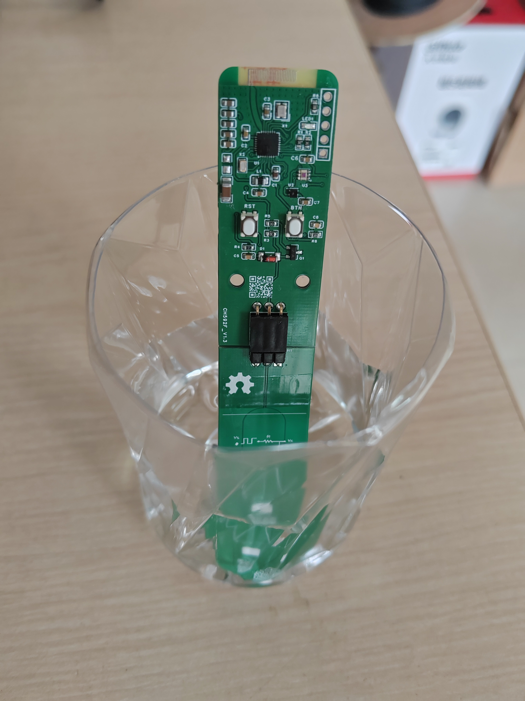

# 基于CH592F芯片的蓝牙土壤湿度传感器
- 概述：   
  传感器采用CH592芯片为主芯片，内部ADC采集电池电压，OPT3001采集光照度，SHT4采集空气温湿度，PCB电路组成的电容测量土壤的湿度，通过BLE广播采集到数据，广播协议采用BTHOME V2.0。 
  测量土壤湿度原理是PWM方波加到RC积分电路，由于是PCB板子组成的电容，土壤水分改变，介电常数就会变化，C的容量就发生变化，测量C上的电压就能得到土壤的湿度；由于电池电压改变，也会引起C两端的电压发生变化，所以根据电池电压不同，拟合多项式，符合电池电压的变化；
  PWM源 → 电阻R → 电容C → 地 (测量输出取自电容两端) 
  项目PCB分为了2片，1片是采集电路部分，另一片是插入土壤的电容部分。这样做有2个原因：1、由于土壤水分会渗透进插入土壤的PCB，使铜箔翘起，传感器失效，所以插入土壤的那部分做成可更换的；2、PCB尺寸都在10CM之内，可以在嘉立创白嫖；   
- 复刻项目建议下单钢网，某宝就可以，比嘉立创要便宜不少。几个QFN芯片的焊接都不怎么友好，用钢网加铁板烧就好多了；Gerber文件和BOM清单都在附件中；
- 板上预留了UART口和下载引脚，从上到下分别是下载、3.3V、TX、RX、GND；刷固件用沁恒自带的WCHISPSTUDIO刷；
- 固件还在改进中，源代码暂不放出，编译好的放附件中；
[Gerber](./gerber/Gerber_CH592_V1.3_2025-08-11.zip)   
[BOM](./gerber/BOM_CH592传感器_V1.3_Schematic_CH592_V1.3_2025-08-11.xlsx)   
[固件](./firmware/Soil-CH592.hex)   

